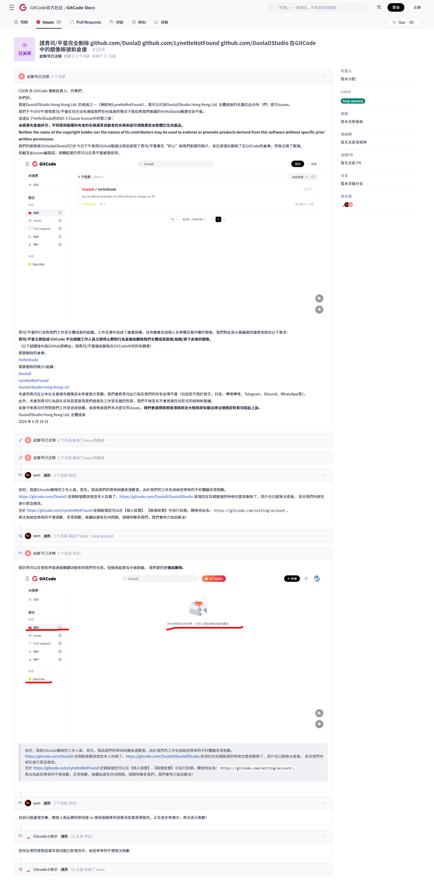

# AntiMainlandChinaWebCrawler/反中国大陆网络爬虫

你是否还在因中国大陆网络爬虫在未经任何通知和允许的情况下私自将你的仓库/账号/组织镜像至它们自家的平台而困扰吗？  
你是否还在担心此类事件会一次又一次的重演呢？  

别担忧！别发愁！  

你只需将此仓库内的所有文件下载下来，在你的仓库内建造一个文件夹用于存放这个仓库中的所有文件，  
即可一劳永逸解决这个问题！  
还在等什么呢？快点动手吧！  

我们并没有在此指名道姓直接表示是哪个平台这样去做了，请勿对号入座。  
如果有人/团队/公司/组织破防了，对，我说的就是你。  

当前仓库敏感词总行数粗略估计大约为47W行+，不定时更新。  
使用简译繁+简译英使得更容易命中爬虫和机器人审核内置词库从而避免此类事件。  

## 〢 冷知识
某平台并没有Clone任何组织和账户地址是台湾的账号，  
所以如果你担心这都拦不住的话就去把组织地区和账户地区改成台湾吧。 XD  

## 〢 2024/09/08 Commit By [GitHub@琳尼特|LynetteNotFound](https://github.com/LynetteNotFound)

致敬[GitCode传奇双标管理员xxm](https://gitcode.com/gitcode-xxm)。  

**面对自己人重拳出击，不予理会需求，直接不予回复/装瞎没看见/删除issues；对同胞/华侨/老外唯唯诺诺，态度温和，诚恳道歉，会根据issues的发起者所使用的语言不同而使用对应的语言进行回复。**  

[我们工作室当时的提交的issues(由本人编写)](https://gitcode.com/Gitcode-offical-team/GitCode-Docs/issues/164) (之前被隐藏提示404无法显示，最近才恢复显示。)：  

  

**平等歧视/鄙视中国大陆所有开源平台/社区，这是我们工作室全体成员的立场。至少我们不会去尊重一个这样的开源平台/社区。**   

**不思进取，只会想着如何逼迫开发者使用自己的平台，而不是创造独属于自己的优点让开发者想要去使用。**  
**并且将原本应该免费提供的功能付费使用，变相削减已有VIP会员权益从而创建更高一级的VIP会员订阅服务。还有一堆非必要/过于严苛的身份验证和代码审核机制......**   
**（PS：我们深知中国大陆企业使用的宽带费用和民用宽带费用差价非常高，但也希望贵平台能尽力保证免费用户和已有付费会员订阅用户的使用体验和最基本且本应拥有的使用权益。）**  

**这样做，只会反复消磨着中国大陆为数不多的，富有荷尔蒙和热情的开源开发者。**  
**这是中国大陆互联网的悲哀。**  

**愿天空再次蔚蓝，愿世界不再有为了突破封锁而生的加密通讯协议和代理软件，愿和平永存，愿自由常伴所有人左右。**  

  <h1 class="header">"因爲爸媽告訴我天亮之前要變得勇敢。"</h1>

## 〢 贡献者
感谢所有贡献者对本项目的奉献！  
以下是本仓库的主要贡献者：

    <table>
        <tr>
            <td>
                <h3>DuolaDStudio Hong Kong Ltd.</h3>
                
		<h3>也就是以下成员：</h3>
		<h5>哆啦D夢|DuolaD & 琳尼特|LynetteNotFound</h5>
		<a href="https://github.com/DuolaD"></img></a>
		
            </td>
	    <td>
                <a href="https://github.com/DuolaDStudio">组织的GitHub主页</a> 
		<a href="https://github.com/DuolaD">哆啦D夢|DuolaD的GitHub个人主页</a> 
		<a href="https://github.com/LynetteNotFound">琳尼特|LynetteNotFound的GitHub个人主页</a> 
		 
		<a>注意:琳尼特|LynetteNotFound没有公开联系方式</a>
            </td>
	</tr>

